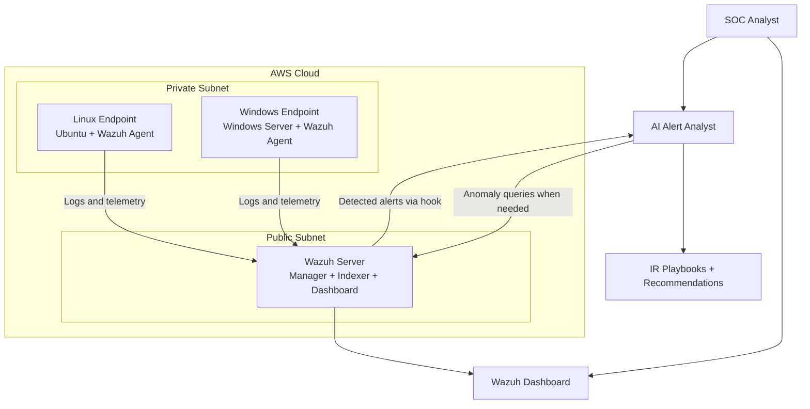

# 🛡️ Cloud SOC Platform

[](https://aws.amazon.com/)
[](https://www.terraform.io/)
[](https://wazuh.com/)
[](https://attack.mitre.org/)
[](ai-analyst/)
[](docs/APT-SIMULATION-DEMO.md)
[](detections/04-macos-attacks.md)
[](LICENSE)

A Terraform-built AWS security lab that deploys Wazuh SIEM, Linux and Windows endpoints, custom detection rules, attack simulations, incident-response playbooks, and an AI analyst workflow for alert triage and anomaly detection.

This repository is designed as a portfolio-grade SOC engineering project: it shows cloud infrastructure, detection engineering, purple-team validation, response documentation, and AI-assisted analysis working together in one reproducible lab.

---

## Contents

- [Highlights](#highlights)
- [Architecture](#architecture)
- [Quick Start](#quick-start)
- [Validation Evidence](#validation-evidence)
- [Detection Engineering](#detection-engineering)
- [Attack Simulation](#attack-simulation)
- [AI Alert Analyst](#ai-alert-analyst)
- [Incident Response](#incident-response)
- [Project Structure](#project-structure)
- [Cost and Cleanup](#cost-and-cleanup)

---

## Highlights

| Area | What this project demonstrates |
|---|---|
| **Cloud infrastructure** | AWS VPC, public/private subnets, NAT Gateway, EC2, IAM roles, and security groups managed with Terraform. |
| **SIEM operations** | Wazuh manager, indexer, dashboard, endpoint agents, custom rule deployment, and alert validation. |
| **Detection engineering** | 82 custom MITRE-mapped rules plus SOCFortress community rules for broader lab coverage. |
| **Purple-team testing** | Linux, Windows, and macOS-oriented attack simulations for credential access, lateral movement, privilege escalation, C2, and exfiltration. |
| **Incident response** | NIST-style playbooks, severity definitions, evidence collection, and reporting templates. |
| **AI-assisted SOC** | LLM-based alert analysis, playbook mapping, Wazuh hook ingestion, feedback capture, notifications, and anomaly detection. |

---

## Architecture



| Component | Default subnet | Purpose |
|---|---|---|
| **Wazuh server** | Public `10.0.1.0/24` | SIEM, dashboard, rule processing, agent management. |
| **Linux endpoint** | Private `10.0.2.0/24` | Ubuntu monitored host for Linux attack simulation and telemetry. |
| **Windows endpoint** | Private `10.0.2.0/24` | Windows Server monitored host for PowerShell/Sysmon telemetry. |
| **macOS endpoint** | Optional | Disabled by default because AWS macOS requires a costly Dedicated Host. |

Detailed diagrams live in [`docs/diagrams/`](docs/diagrams/).

---

## Quick Start

### Prerequisites

- AWS account and credentials configured for the target account.
- Terraform `>= 1.0`.
- Existing AWS EC2 key pair.
- Matching local private key for Terraform SSH provisioners.
- Your current public IP in CIDR form, for example `203.0.113.10/32`.

### 1. Configure Terraform

```bash
git clone https://github.com/trewwwsec/tf-aws-soc.git
cd tf-aws-soc/terraform
cp terraform.tfvars.example terraform.tfvars
```

Edit `terraform.tfvars`:

```hcl
aws_region = "us-east-1"
environment = "lab"
project_name = "cloud-soc"

allowed_ssh_cidr = ["YOUR.PUBLIC.IP.HERE/32"]
ssh_key_name = "cloud-soc-key"
ssh_private_key_path = "~/.ssh/cloud-soc-key.pem"

wazuh_instance_type = "t3.medium"
endpoint_instance_type = "t3.micro"
enable_macos_endpoint = false
```

### 2. Plan and deploy

```bash
terraform init
terraform fmt -check
terraform validate
terraform plan -out=tfplan
terraform apply tfplan
```

Wazuh bootstrap usually takes **5–10 minutes** after the EC2 instance starts. The Terraform rule provisioner waits before connecting, but if your public IP changes mid-deploy, update `allowed_ssh_cidr` and rerun `terraform apply`.

> **SOCFortress note:** the upstream SOCFortress rule installer can prompt for confirmation. If Terraform blocks at that step, complete the installer manually over SSH or adjust the provisioner to run it non-interactively before using this in unattended CI.

### 3. Access Wazuh

```bash
terraform output wazuh_server_public_ip
terraform output wazuh_dashboard_url

# Retrieve dashboard credentials from the Wazuh server
cd ..
./scripts/get-wazuh-info.sh
./scripts/get-wazuh-info.sh --all
```

### 4. Validate the deployment

```bash
# On the Wazuh server
sudo systemctl is-active wazuh-manager wazuh-indexer wazuh-dashboard
sudo /var/ossec/bin/agent_control -l
sudo ls -lh /var/ossec/etc/rules/local_rules.xml /var/ossec/etc/rules/macos_rules.xml
sudo tail -n 200 /var/ossec/logs/ossec.log | grep -Ei 'fatal|error' || true
```

Expected baseline:

- Wazuh manager, indexer, and dashboard are active.
- Server, Linux endpoint, and Windows endpoint are registered in Wazuh.
- Custom rule files exist and are readable by Wazuh.
- No recent fatal rule-load errors.

---

## Validation Evidence

Latest lab validation performed in AWS:

| Check | Result |
|---|---|
| Terraform preflight | `fmt -check`, `validate`, and `plan` passed. |
| Wazuh services | `wazuh-manager`, `wazuh-indexer`, and `wazuh-dashboard` active. |
| Endpoint agents | Linux and Windows agents active in Wazuh. |
| Dashboard reachability | HTTPS returned `302` from the Wazuh dashboard. |
| Custom detections | Wazuh generated custom-rule alerts `200020` and `200094`. |
| AI Analyst tests | `55 passed` with `uv run --with-requirements ai-analyst/requirements.txt python -m pytest ai-analyst/tests -q`. |
| Cleanup | `terraform destroy` completed with `22 destroyed`. |

Screenshots from a prior live demo are available in [`docs/APT-SIMULATION-DEMO.md`](docs/APT-SIMULATION-DEMO.md).

---

## Detection Engineering

### Custom rule coverage

| Ruleset | Count | Rule IDs | Notes |
|---|---:|---|---|
| Windows/Linux custom rules | 50 | `200001`–`200124` | SSH brute force, PowerShell abuse, privilege escalation, account changes, persistence, credential access, lateral movement, and exfiltration. |
| macOS custom rules | 32 | `200200`–`200272` | Launch agents/daemons, shell activity, Gatekeeper/SIP/TCC abuse, keychain access, browser credentials, and persistence. |
| **Total custom rules** | **82** | `200xxx` | MITRE ATT&CK mapped custom lab detections. |

SOCFortress community rules add broader Wazuh detection content during deployment. The exact community rule count can change upstream, so custom rules are the stable project-owned detection set.

### Example custom rule

```xml
<rule id="200001" level="10" frequency="5" timeframe="120">
  <if_matched_sid>5551</if_matched_sid>
  <same_source_ip />
  <description>SSH brute force attack detected - 5+ failures in 2 minutes</description>
  <mitre>
    <id>T1110</id>
  </mitre>
  <group>authentication_failures,brute_force,MITRE_T1110,PCI_DSS_10.2.4</group>
</rule>
```

Read the rules directly:

- [`wazuh/custom_rules/local_rules.xml`](wazuh/custom_rules/local_rules.xml)
- [`wazuh/custom_rules/macos_rules.xml`](wazuh/custom_rules/macos_rules.xml)
- [`docs/MITRE_COVERAGE.md`](docs/MITRE_COVERAGE.md)
- [`detections/README.md`](detections/README.md)

---

## Attack Simulation

The [`attack-simulation/`](attack-simulation/) toolkit provides controlled purple-team activity for validating Wazuh detections in the lab.

| Script | Platform | Coverage |
|---|---|---|
| `run-all-linux.sh` | Linux | Orchestrates Linux simulations and writes a summary report. |
| `privilege-escalation.sh` | Linux | Sudo abuse and privileged group modification. |
| `apt-credential-harvest.sh` | Linux/macOS | Shadow file access, SSH key discovery, shell history, browser/cloud credential checks. |
| `apt-lateral-movement.sh` | Linux/macOS | Network discovery, metadata access, service enumeration, SSH pivoting, and log tampering. |
| `apt-c2-exfil.sh` | Linux/macOS | HTTP beaconing, DNS tunneling, local staging, base64 HTTP exfiltration, and LOLBin transfer techniques. |
| `powershell-attacks.ps1` | Windows | Encoded commands and PowerShell abuse scenarios. |
| `macos-attacks.sh` | macOS | macOS persistence, credential access, and defense-evasion tests. |
| `apt-full-killchain.sh` | Multi-platform | Multi-victim orchestration across Linux, macOS, and Windows targets. |

Run only inside an isolated lab you own or are authorized to test:

```bash
cd attack-simulation
./run-all-linux.sh
```

Verify alerts on Wazuh:

```bash
sudo grep 'Rule: 200' /var/ossec/logs/alerts/alerts.log | tail -30
sudo grep -o '"id":"200[0-9]*"' /var/ossec/logs/alerts/alerts.json | sort | uniq -c | sort -rn
```

More detail: [`attack-simulation/README.md`](attack-simulation/README.md), [`attack-simulation/QUICK-REFERENCE.md`](attack-simulation/QUICK-REFERENCE.md), and [`docs/APT-SIMULATION-DEMO.md`](docs/APT-SIMULATION-DEMO.md).

---

## AI Alert Analyst

The [`ai-analyst/`](ai-analyst/) service adds AI-assisted SOC workflows on top of Wazuh alerts.

Key capabilities:

- **Hook-first alert ingestion:** Wazuh can send detected alerts to the Alert Analyzer instead of requiring the analyzer to poll Wazuh for alert triage.
- **Wazuh API access for anomaly detection:** anomaly detection can still query Wazuh for event windows and baselines.
- **FastAPI server:** exposes alert intake, feedback, webhook, and analysis endpoints.
- **RAG playbook mapping:** chunks and retrieves relevant incident-response playbook sections.
- **Provider support:** OpenAI, Anthropic, and local Ollama-compatible workflows.
- **Operational feedback:** stores analyst feedback and supports webhook notifications.

Quick start:

```bash
cd ai-analyst
uv run --with-requirements requirements.txt python src/analyze_alert.py --demo
uv run --with-requirements requirements.txt python src/detect_anomalies.py --demo
uv run --with-requirements requirements.txt uvicorn src.api_server:app --host 0.0.0.0 --port 8000
```

Regression tests:

```bash
uv run --with-requirements ai-analyst/requirements.txt python -m pytest ai-analyst/tests -q
```

More detail: [`ai-analyst/README.md`](ai-analyst/README.md) and [`ai-analyst/RAG.md`](ai-analyst/RAG.md).

---

## Incident Response

Incident-response content follows a NIST-style lifecycle:

```text
Preparation → Detection & Analysis → Containment → Eradication → Recovery → Post-Incident
```

| Playbook | Severity target | MITRE focus |
|---|---|---|
| [`SSH Brute Force`](incident-response/playbooks/ssh-brute-force.md) | High | T1110 |
| [`Credential Dumping`](incident-response/playbooks/credential-dumping.md) | Critical | T1003 |
| [`PowerShell Abuse`](incident-response/playbooks/powershell-abuse.md) | High | T1059.001 |
| [`Privilege Escalation`](incident-response/playbooks/privilege-escalation.md) | High | T1548 |
| [`Persistence`](incident-response/playbooks/persistence.md) | High | T1543 |
| [`macOS Compromise`](incident-response/playbooks/macos-compromise.md) | High | macOS-specific |

Evidence collection helper:

```bash
./incident-response/tools/collect-evidence.sh <hostname> <incident-id>
```

See [`incident-response/README.md`](incident-response/README.md) and [`incident-response/templates/incident-report-template.md`](incident-response/templates/incident-report-template.md).

---

## Project Structure

```text
tf-aws-soc/
├── terraform/                  # AWS infrastructure as code
│   ├── provider.tf             # Terraform and AWS provider configuration
│   ├── vpc.tf                  # VPC, subnets, route tables, NAT Gateway
│   ├── ec2.tf                  # Wazuh and endpoint EC2 instances
│   ├── security_groups.tf      # Wazuh, Linux, and Windows security groups
│   ├── iam.tf                  # EC2 IAM roles and instance profiles
│   ├── outputs.tf              # Dashboard, IP, and SSH outputs
│   └── user_data/              # Wazuh and agent bootstrap scripts
├── wazuh/custom_rules/         # Project-owned Wazuh rules
├── attack-simulation/          # Purple-team validation scripts
├── detections/                 # Detection documentation and test helpers
├── incident-response/          # Playbooks, templates, and evidence tooling
├── ai-analyst/                 # AI analysis, anomaly detection, and API server
├── docs/                       # Diagrams, demo evidence, and coverage docs
└── scripts/                    # Utility scripts
```

---

## Cost and Cleanup

Approximate always-on lab cost in `us-east-1` with default instance sizes:

| Resource | Default | Notes |
|---|---|---|
| Wazuh server | `t3.medium` | Required for all-in-one Wazuh lab performance. |
| Linux endpoint | `t3.micro` | Free-tier eligible in some accounts, subject to AWS terms. |
| Windows endpoint | `t3.micro` | Windows licensing affects actual cost. |
| NAT Gateway + EBS | Managed AWS resources | NAT Gateway can be a meaningful hourly cost. |
| macOS endpoint | Disabled | Requires Dedicated Host if enabled; expensive and minimum host allocation rules apply. |

Destroy resources when testing is complete:

```bash
cd terraform
terraform destroy
terraform state list
```

`terraform state list` should be empty after a successful teardown.

---

## Documentation Index

- [`docs/README.md`](docs/README.md) — documentation overview.
- [`docs/diagrams/`](docs/diagrams/) — architecture and workflow diagrams.
- [`docs/MITRE_COVERAGE.md`](docs/MITRE_COVERAGE.md) — MITRE ATT&CK coverage.
- [`docs/AI_API_ACTIVE_RESPONSE.md`](docs/AI_API_ACTIVE_RESPONSE.md) — AI API and active-response notes.
- [`detections/README.md`](detections/README.md) — detection deployment guide.
- [`attack-simulation/README.md`](attack-simulation/README.md) — attack simulation framework.
- [`incident-response/README.md`](incident-response/README.md) — IR framework.
- [`ai-analyst/README.md`](ai-analyst/README.md) — AI analyst details.

---

## Skills Demonstrated

- AWS networking and compute security.
- Terraform infrastructure as code.
- Wazuh SIEM deployment and tuning.
- MITRE ATT&CK-aligned detection engineering.
- Linux, Windows, and macOS security telemetry.
- Purple-team simulation and detection validation.
- Incident-response playbook development.
- Python/FastAPI AI analyst service design.
- LLM-assisted triage, RAG retrieval, and anomaly detection.

---

## Contributing

Useful contribution areas:

- Make the SOCFortress provisioner fully non-interactive.
- Add CI checks for Terraform validation and documentation drift.
- Expand Windows simulation automation.
- Add more Wazuh API-backed live anomaly tests.
- Add multi-region or high-availability Terraform variants.

Development basics:

```bash
git checkout -b feature/your-change
python3 scripts/validate_docs.py
uv run --with-requirements ai-analyst/requirements.txt python -m pytest ai-analyst/tests -q
git push origin feature/your-change
```

---

## License

This project is licensed under the MIT License. See [`LICENSE`](LICENSE).

## Acknowledgments

- [Wazuh](https://wazuh.com/) for open-source security monitoring.
- [MITRE ATT&CK](https://attack.mitre.org/) for adversary behavior mapping.
- [SOCFortress](https://github.com/socfortress/Wazuh-Rules) for community Wazuh rule content.
- [Atomic Red Team](https://github.com/redcanaryco/atomic-red-team) for attack simulation inspiration.
- [Terraform](https://www.terraform.io/) for infrastructure as code.

---

<p align="center"><strong>Built for hands-on cloud SOC engineering, detection validation, and AI-assisted security operations.</strong></p>
